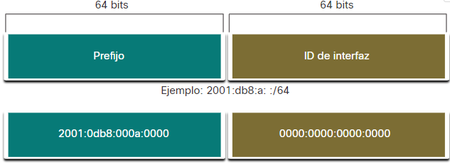
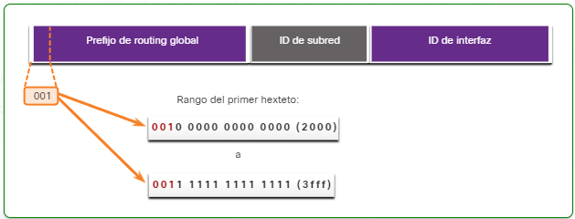
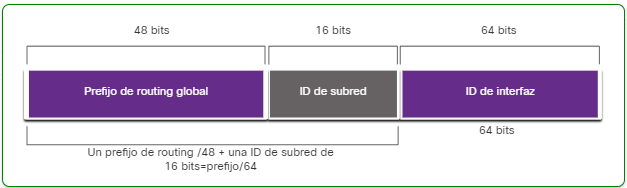

# IPv6 Conceptos y Ejemplos

- [IPv6 Conceptos y Ejemplos](#ipv6-conceptos-y-ejemplos)
  - [Introducción al reenvío de Host](#introducción-al-reenvío-de-host)
    - [Visualizar tablas de enrutamiento de Host](#visualizar-tablas-de-enrutamiento-de-host)
    - [Enrutamiento Estático](#enrutamiento-estático)
    - [Enrutamiento Dinámico](#enrutamiento-dinámico)
  - [Unidifusión, Multidifusión, Anycast](#unidifusión-multidifusión-anycast)
  - [Longitud de prefijo IPv6](#longitud-de-prefijo-ipv6)
  - [Tipos de direcciones de unidifusión IPv6](#tipos-de-direcciones-de-unidifusión-ipv6)
    - [Dirección de Difusión Global (GUA)](#dirección-de-difusión-global-gua)
    - [Dirección Local de Enlace (LLA)](#dirección-local-de-enlace-lla)
    - [GUA IPv6](#gua-ipv6)
    - [Estructura IPv6 GUA](#estructura-ipv6-gua)
      - [Prefijo de enrutamiento global](#prefijo-de-enrutamiento-global)
      - [ID de subred](#id-de-subred)
      - [ID de interfaz](#id-de-interfaz)
    - [LLA IPv6](#lla-ipv6)
  - [Configuración estática GUA y LLA](#configuración-estática-gua-y-lla)
    - [GUA estática en un Router](#gua-estática-en-un-router)
    - [Configuración estática de LLA](#configuración-estática-de-lla)
  - [Direccionamiento dinámico para GUA IPv6](#direccionamiento-dinámico-para-gua-ipv6)
    - [Mensajes RS y RA](#mensajes-rs-y-ra)
    - [Método 1: SLAAC](#método-1-slaac)
    - [Método 2: SLAAC y DHCPv6 sin estado](#método-2-slaac-y-dhcpv6-sin-estado)
    - [Método 3: DHCPv6 con estado (sin SLAAC)](#método-3-dhcpv6-con-estado-sin-slaac)
    - [Proceso EUI-64](#proceso-eui-64)
    - [ID de interfaz generados aleatoriamente](#id-de-interfaz-generados-aleatoriamente)
  - [Direccionamiento dinámico para LLA IPv6](#direccionamiento-dinámico-para-lla-ipv6)
    - [LLA dinámicos](#lla-dinámicos)
  - [Direcciones Multicast de IPv6](#direcciones-multicast-de-ipv6)
    - [Direcciones IPv6 de multidifusión asignadas](#direcciones-ipv6-de-multidifusión-asignadas)

- - -

IPv6 conceptos básicos y ejemplos de dos cursos: CISCO y PROFE24.

## Introducción al reenvío de Host

En IPv4 o IPv6 los paquetes se crean en el host de origen. Este host, dirige los paquetes al host de destino. Para ello se crean las tablas de enrutamiento.

La función de la **capa de red** es dirigir los paquetes entre los hosts:

- **A si mismo**. Un host puede hacerse ping a sí mismo, al enviar un paquete a una dirección **IPv4 127.0.0.1** o a una **IPv6 ::1**, a la que se hace referencia como la interfaz de bucle invertido.
- **Host local**. Este es un host de destino que se encuentra en la misma red local que el host emisor. Los host de origen y destino comparten la misma dirección de red.
- **Host remoto**. Este es un host de destino en una red remota. Los host de origen y destino con comparten la misma dirección de red.

En **IPv4**, el dispositivo de origen utiliza su propia máscara de subred junto con su propia dirección IPv4 y la dirección IPv4 de destino para realizar esta determinación.

En **IPv6** el enrutador local anuncia la dirección de red local (prefijo) a todos los dispositivos de la red.

### Visualizar tablas de enrutamiento de Host

En un OS con W10/11, el comando `route print` o `netstat -r` se usa para mostrar la tabla de enrutamiento del host. La tabla muestra tres secciones realizadas con las conexiones de red TCP/IP actuales:

- Lista de interfaces. Enumera la dirección de control de acceso a medios MAC y el número de interfaz asignado de cada interfaz con capacidad de red en el host, incluidos los adaptadores Ethernet, WiFi.
- Tabla de enrutamiento IPv4. Es una lista de todas las rutas IPv4 conocidas, incluidas las conexiones directas, las redes locales y las rutas locales predeterminadas.
- Tabla de enrutamiento IPv6. Es una lista de todas las rutas IPv6 conocidas, incluidas las conexiones directas, las redes locales y las rutas locales predeterminadas.

La tabla de enrutamiento almacena tres tipos de enlaces de ruta:

- Redes conectadas directamente. Enlaces de ruta de red activas.
- Redes remotas. Enlaces de ruta de red están conectadas a otros Routers.
- Ruta predeterminada. Los Routers incluyen un enlace de ruta predeterminada, una puerta de enlace predeteminada.

El comando para visualizar la tabla de enrutamiento es `show ip route` en modo EXEC privilegiado. Entre las fuentes de ruta comunes se incluyen:

- **L**. Dirección IP de interfaz local conectada directamente.
- **C**. Red conectada directamente.
- **S**. La ruta estática fue configurada manualmente por un Administrador.
- **O**. Open Shortest Path First (OSPF).
- **D**. Enhanced Interior puerta de enlace predeterminada Routing Protocol (EIGRP).

### Enrutamiento Estático

Son enlaces de ruta que se configuran manualmente. La ruta estática incluye la dirección de red remota y la dirección IP del enrutador de salto siguiente.

### Enrutamiento Dinámico

Permite a los Routers aprender automáticamente sobre redes remotas, incluida una ruta predeterminada, de otros Routers. Se comparte la información mediante el protocolo dinámico (OSPF, EIGRP) actualizando las tablas. Este protocolo hará automáticamente lo siguiente:

- Detectar redes remotas.
- Mantener información de enrutamiento actualizada.
- Elija el mejor camino hacia las redes de destino.
- Intente encontrar una nueva mejor ruta si la ruta actual ya no está disponible.

## Unidifusión, Multidifusión, Anycast

Existen tres categorías de direcciones IPv6:

- **Difusión**. Una dirección de difusión IPv6 identifican de forma exclusiva una interfaz en un dispositivo con IPv6 habilitado.
- **Multidifusión**. Una dirección de multidifusión IPv6 se utiliza para enviar un único paquete a varios destinos.
- **Anycast**. Una dirección IPv6 *anycast* es cualquier dirección de difusión que se puede asignar a varios dispositivos.

- - -

## Longitud de prefijo IPv6

El **prefijo** de una dirección IPv4 se puede identificar mediante la máscara de subred. En **IPv6** no utiliza la notación decimal de máscara de subred. La longitud de prefijo se representa en notación de barra inclinada y se usa para indicar la porción de red de una dirección IPv6.

La **longitud de prefijo** puede ir de 0 a 128. La recomendada es /64.

El **prefijo** o la porción de red de la dirección tiene 64 bits de longitud, dejando otros 64 bits para la ID de interfaz de la dirección.

La autoconfiguración de direcciones sin estado **SLAAC** utiliza 64 bits para el ID de la interfaz, también facilita la creación y gestión de subredes.

- - -

## Tipos de direcciones de unidifusión IPv6

Las direcciones IPv6 de difusión identifican de forma exclusiva una interfaz. Existen diferentes tipos de **direcciones de difusión IPv6 Unicast**.

- Unidifusión global.
- Link-Local.
- Loopback (**::1/128**)
- Dirección sin especificar (**::**)
- Local única (fc00::/7 - fdff::/7)
- IPv4 integrada.

### Dirección de Difusión Global (GUA)

Las **GUA** pueden configurarse estáticamente o asignarse dinámicamente.

Estas son similares a las direcciones IPv4 públicas. Son enrutables de Internet globalmente exclusivas.

### Dirección Local de Enlace (LLA)

Se requiere para cada dispositivo habilitado para IPv6. Los **LLA** se utilizan para comunicarse con otros dispositivos en el mismo enlace local en una subred. No se pueden enrutar más allá del enlace.

Las **direcciones locales únicas** con rango **fc00::/7 a fdff::/7** aún no se implementan regularmente. Se pueden usar **direcciones locales únicas** para dirigir dispositivos a los que no se debe acceder desde el exterior.

Las **direcciones locales únicas IPv6** tienen cierta similitud con las direcciones privadas RFC 1918 para IPv4, aunque las diferencias son:

- Las direcciones locales únicas se utilizan para el direccionamiento local dentro de un sitio o entre una cantidad limitada de sitios.
- Se pueden utilizar direcciones locales únicas para dispositivos que nuncan necesitarán acceder a otra red.
- Las direcciones locales únicas no se enrutan o traducen globalmente a una dirección IPv6 global.

### GUA IPv6

Las **direcciones IPv6 de difusión globales (GUA)** son globalmente únicas y enrutables en Internet IPv6. Estas direcciones son equivalentes a las direcciones IPv4 públicas.

La Autoridad de Asignación de Números de Internet (IANA) que asigna bloques de direcciones IPv6 a los cinco RIR. Actualmente, solo se están asignando GUAs con los primeros tres bir de **001** ó **2000::/3**.

La figura muestra el rango de valores para el primer sexteto donde el primer dígito hexadecimal para las **GUA** disponibles actualmente comienza con un **2** o un **3**. La dirección **2001:odb8::/32** se reservó para fines de documentación, incluido el uso en ejemplos.

Dirección IPv6 con un **prefijo** de enrutamiento global /48 y un **prefijo** /64.

Las **GUA** tienen tres partes:

- Prefijo de enrutamiento global.
- ID de subred.
- ID de interfaz.

### Estructura IPv6 GUA

#### Prefijo de enrutamiento global

Es la porción de prefijo, o de red, de la dirección que asigna el proveedor a un cliente o a un sitio. Los ISP asignan un **prefijo de enrutamiento global /48** a sus clientes.

Por ejemplo: la dirección IPv6 2001:db8:acad::/48 tiene un prefijo de enrutamiento global, que indica, que los primeros 48 bits (*3 sextetos*) (2001:db8:acad) es cómo el ISP conoce este prefijo (red). Los dos puntos dobles (::) que siguen a la longitud del prefijo /48 significa que el resto de la dirección contiene todos los 0.

El tamaño del prefijo global determina el tamaño de la ID de subred.

#### ID de subred

El campo **ID de subred** es el área entre el **prefijo de enrutamiento global** y la **ID de interfaz**. IPv6 se diseña teniendo en cuenta la subred, utilizando la ID de subred, para identificar una subred dentro de su ubicación. Cuando mayor es la ID, más subredes habrá disponibles.

Las direcciones IPv6 suelen tener un prefijo de enrutamiento global /48. Usando una longitud de prefijo /64 típica, los primeros cuatro sextetos son para la porción de red de la dirección y el cuarto sexteto indica la ID de subred. Los cuatro sextetos restantes son para la ID de interfaz.

#### ID de interfaz

La **ID de interfaz IPv6** equivale a la porción de host de una dirección IPv4. Un único Host puede tener varias interfaces, cada una con una o más direcciones IPv6. Recomendándose en la mayoría de los casos utilizar subredes /64, lo que crea una ID de interfaz de 64 bits.

Una subred o prefijo /64 (*prefijo de enrutamiento global + ID de subred*) deja 64 bits para el ID de interfaz. Esto se recomienda para permitir que los dispositivos habilitados para **SLAAC** creen su propia ID de interfaz de 64 bits.

En IPv6 se pueden asignar las direcciones de host compuestas solo por ceros y unos a un dispositivo. La dirección *all-1s*, se puede utiliar porque las direcciones de difusión no se utilizan en IPv6. También se puede utilizar la dirección compuesta solo por ceros, aunque se reserva como una dirección **Anycast** de subred y enrutador, y se debe asignar solo a Routers.

### LLA IPv6

Una **dirección local de enlace IPv6 (LLA)** permite que un dispositivo se comunique con otros dispositivos habilitados para IPv6 en el mismo enlace y sólo en ese enlace (subred). Los paquetes con un **LLA** de origen o destino no se pueden enrutar más allá del enlace desde el que se originó el paquete.

Mientras que la **GUA** no es un requisito, sin embargo, cada interfaz de red habilitada para IPv6 debe tener una **LLA**.

Si un **LLA** no se configura manualmente en una interfaz, el dispositivo creará automáticamente el suyo sin comunicarse con un servidor DHCP. Los hosts con IPv6 habilitado crean un **LLA** de IPv6 incluso si el dispositivo no tiene asignada una dirección IPv6 de difusión global. Esto permite que los dispositivos con IPv6 habilitado se comuniquen con otros dispositivos con IPv6 habilitado en la misma subred, incluyendo la puerta de enlace.

Las direcciones **LLA IPv6** están en el rango **fe80::/10** donde /10 indica, que los primeros 10 bits son *1111 1110 10xx xxxx*. El primer sexteto tiene un rango de *1111 1110 1**000 0000*** (fe80) a *1111 1110 10**11 1111*** (febf).

Por lo general, es el **LLA** del Router y no la **GUA** la que se usa, como puerta de enlace predeterminada para otros dispositivos en el enlace.

Hay dos maneras en que un dispositivo puede obtener una **LLA**:

- **Estáticamente**, el dispositivo es configura manualmente.
- **Dinámicamente**, el dispositivo crea su propia ID de interfaz usando valores generados aleatoriamente o usando el **Método de Identificador Único Extendido (EUI)**, que usa la dirección de control de acceso a medios MAC del cliente junto con bits adicionales.

## Configuración estática GUA y LLA

### GUA estática en un Router

Las **GUA IPv6** son las mismas que las IPv4 públicas. **ELLA** son globalmente únicas y enrutables en Internet IPv6.

El comando Cisco IOS para configurar una **GUA IPv6** en una interfaz es `ipv6 address/prefix-length`. Ejemplo: `R1(config-if)# ipv6 address 2001:db8:acad:1::1/64`.

El uso de la **LLA** del Router como dirección de *puerta de enlace predeterminada*, se considera una práctica recomendada.

Hay dos formas, en que un dispositivo pueda obtener una **GUA IPv6** automáticamente:

- Configuración automática de direcciones sin estado (SLAAC)
- DHCPv6 con estado.

### Configuración estática de LLA

Configurar la **LLA** manualmente permite crear una dirección reconocible y más fácil de recordar. Las **LLAS** se pueden configurar manualmente el comando `ipv6 address ipv6-address`.

Cuando una dirección comienza con este sexteto dentro del rango de **fe80** a **febf**, el parámetro del enlace local, debe seguir a la dirección.

Ejemplo de configuración en un Router Cisco: `R1(config-if)# ipv6 address fe80::1:1 de enlace local`.

Se podría configurar exactamente la misma **LLA** en cada enlace, siempre que sea única en ese enlace.

## Direccionamiento dinámico para GUA IPv6

### Mensajes RS y RA

**Mensajes de anuncio de enrutador (RA)**. 
**Mensajes de solicitud de enrutador (RS)**.

Para el **GUA**, un dispositivo obtiene la dirección dinámicamente a través de mensajes del *Protocolo* de mensajes de control de Internet versión 6 (ICMPv6).

Los Routers envían mensajes **RA** de ICMPv6 periódicamente, cada 200 segundos, a todos los dispositivos con IPv6 en la red. También se enviará un mensaje **RA** en respuesta a un host que envía un mensaje ICMPv6 **RS**, que es una solicitud de un mensaje **RA**.

1. Los *Hosts* que solicitan información de direccionamiento envían mensajes **RS** a todos los *Routers* IPv6.
2. Si se usa el método **SLAAC**, el **RA** incluye el prefijo de red, la longitud del prefijo y la información sobre la puerta de enclace predeterminada.

El mensaje **ICMPv6 RA** incluye lo siguiente:

- **Prefijo de red**.
- **Longitud de prefijo**. Esto le dice al dispositivo a qué red pertenece.
- **Dirección de puerta de enlace predeterminada**. Es una IPv6 LLA, la dirección IPv6 de origen del mensaje RA.
- **Direcciones DNS y de nombre de dominio**. Direcciones de los servidores DNS.

Existen tres métodos para los mensajes **RA**:

- Método 1: **SLAAC**. Tengo todo lo que necesita, incluido: el prefijo, la longitud y la dirección de la puerta de enlace predeterminada.
- Método 2: **SLAAC con un servidor DHCPv6 sin estado**. Aquí está mi información, pero necesita obtener otra información como direcciones DNS, de un servidor DHCPv6 sin estado.
- Método 3: **DHCPv6 con estado (sin SLAAC)**. Puedo darle su dirección de la puerta de enlace predeterminada, necesita pedir a un servidor DHCPv6 con estado para toda su otra información.

### Método 1: SLAAC

**SLAAC** es un Método que permite a un dispositivo, crear su propio **GUA** sin los servicios de **DHCPv6**.

Usando **SLAAC** los dispositivos confían en los mensajes **ICMPv6 RA** del Router local para obtener la información necesaria. El dispositivo cliente, usa la información en el mensaje **RA** para crear su propia **GUA**.

**SLAAC** no tiene estado, lo que significa que no hay un servidor central (por ejemplo, un servidor DHCPv6 con estado) que asigne **GUA** y mantenga una lista de dispositivos y sus direcciones.

- *Prefijo*. Se anuncia en el mensaje Ra.
- *ID de interfaz*. Utiliza el proceso EUI-64 o genera un número aleatorio de 64 bits, según el OS del dispositivo.

### Método 2: SLAAC y DHCPv6 sin estado

El mensaje **RA** sugiere que los dispositivos utilicen:

- SLAAC para crear su propio IPv6 GUA.
- La dirección de enlace local del Router; la dirección IPv6 de origen del RA para la dirección de la puerta de enlace predeterminada.
- Un servidor DHCPv6 sin estado, que obtendrá otra información como la dirección del servidor DNS y el nombre de dominio.

Un **Servidor DHCPv6** sin información de estado, distribuye las direcciones del **Servidor DNS** y los nombre de dominio. No asigna **GUA**.

### Método 3: DHCPv6 con estado (sin SLAAC)

Una interfaz del Router, se puede configurar para enviar una **RA** usando **DHCPv6** con estado solamente.

**DHCPv6 con información de estado** es similar a DHCP para IPv4.

Un dispositivo puede recibir automáticamente su información de direccionamiento, inlcuida una **GUA**, la longitud del prefijo y las direcciones de los servidores DNS de un servidor DHCPv6 con estado.

Con este Método, el mensaje **RA** sugiere que los dispositivos usen:

- La dirección **LLA** del Router, que es la dirección IPv6 de origen del **RA**, para la dirección de la puerta de enlace predeterminada.
- Un Servidor DHCPv6 con estado, para obtener una **GUA**, otra información como la dirección del servidor DNS y el nombre de dominio.

Un **Servidor DHCPv6 con información de estado** asigna y mantiene una lista, de qué dispositivo recibe cuál dirección IPv6.

La dirección de puerta de enlace predeterminada, solo se puede obtener dinámicamente a partir del mensaje RA. El servidor DHCPv6 con información de estado o sin ella no brinda la dirección de puerta de enlace predeterminada.

### Proceso EUI-64

Cuando el mensaje **RA** es **SLAAC** con **DHCPv6 sin estado**, el cliente debe generar su propia ID de interfaz. El cliente conoce la parte del **prefijo** de la dirección del mensaje **RA**, pero debe crear su propia ID de interfaz. El ID de la interfaz se puede crear utilizando el proceso EUI-64 o un número de 64 bits generado aleatoriamente.

El proceso EUI-64 utiliza la dirección **MAC Ethernet de 48 bits** de un cliente e inserta otros 16 bits en el medio de la dirección MAC de 48 bits para crear una ID de interfaz de 64 bits.

Las direcciones **MAC Ethernet**, se representa en formato hexadecimal y consta de dos partes:

- Indentificador único de organización (OUI). El OUI es un código de proveedor de 24 bits (6 dígitos hexadecimales) que asigna el IEEE.
- Identificación de dispositivos. El identificador de dispositivo es un valor único de 24 bits (6 dígitos hexadecimales) dentro de un OUI común.

Las direcciones MAC Ethernet, por lo general, se representan en formato binario y constan de tres partes:

- OUI de 24 bits de la dirección MAC del cliente, pero el 7th bit (bit universal/local, U7L) se invierte. Esto quiere decir que si el 7th bit es un 0, se transforma en un 1 y viceversa.
- El valor insertado de 16 bits **fffe** en hexadecimal.
- Identificador de dispositivo de 24 bits de la dirección MAC del cliente.

El proceso **EUI-64** utiliza la dirección **MAC R1 GigabitEthernet** de **fc99:4775:cee0**.

[EUI-64](imagenes/macr1gigaether.png)

- Paso 1: dividir la dirección MAC entre el OUI y el identificador de dispositivo.
- Paso 2: insertar el valor hexadecimal fffe, que en formato binario es 1111-1111-1111-1110.
- Paso 3: convertir los primeros dos valores hexadecimales del OUI a binario e invertir el bit U/L (7th bit).
- El resultado es un ID de interfaz generado por EUI-64 de: fe99:47ff:fe75:cee0.

### ID de interfaz generados aleatoriamente

Un dispositivo puede utilizar una ID de interfaz generada aleatoriamente en lugar de utilizar la dirección MAC y el proceso EUI-64. Windows utiliza una ID de interfaz generada aleatoriamente en lugar de una ID de interfaz creada mediante EUI-64.

Una vez establecida la ID de la interfaz, ya sea a través del proceso EUI-64 o mediante la generación aleatoria, se puede combinar con un prefijo IPv6 en el mensaje RA para crear una GUA.

Para garantizar la exclusividad de cualquier dirección de difusión de IPv6, el cliente puede usar un proceso denominado **detección de direcciones duplicadas (DAD)**. Es similar a una solicitud de **ARP** para su propia dirección. Si no se obtiene una respuesta, la dirección es única.

## Direccionamiento dinámico para LLA IPv6

### LLA dinámicos

Todos los dispositivos deben tener una **LLA IPv6**. Al igual que **GUA IPv6** también puede crear **LLA** dinámicamente. Independientemente de cómo cree las **LLA**, es importante que verifique toda la configuración de direcciones IPv6.

El **LLA** se crea dinámicamente usando el prefijo **fe80::/10** y la ID de interfaz usando el proceso EUI-64 o un número de 64 bits generado aleatoriamente.

Los OS Windows, suelen utilizar el mismo Método, tanto para una **GUA** creada por **SLAAC** como para una **LLA** asignada dinámicamente.

## Direcciones Multicast de IPv6

### Direcciones IPv6 de multidifusión asignadas